# Use Watson Knowledge Studio and Speech To Text to automate offline order processing during pandemics

How do we stop panic amongst people of hoarding essentials during lockdown? How do we maintain social distancing while procuring essentials?

Majority of Indian population (specially elderly population) do not have knowledge about digital services. Hence, they will not be able to use the available online portals to order daily essentials & medicines.

A toll free number (ex :- dial *222) based approach to contact control tower will be a better option. Here the user will be able to call toll free number and order the essentials. This will address the limitation mentioned above and will have wider reach with the population to make use of the facility. However,with majority of them using this toll free number based approach the traffic at the backend will be very high. To process of these calls manually will be tedious.

In this code pattern, we propose an AI-powered backend system that can take the daily essentials orders through offline mode. The system processes the audio request by converting it to formatted orders list. A smart way of processing the information quickly.

This AI powered backend system can be later connected to the inventory database for optimising supply chain management aswell. This solution will be applicable into various domains such as ordering medicines and ordering daily essentials(groceries), etc.

When the reader has completed this Code Pattern, they will understand how to:

* Use Speech to Text service.
* Use Watson Language Translator.
* Use and train model on Watson Knowledge Studio.
* Deploy model on Watson Natural Language Understanding.

<!--add an image in this path-->
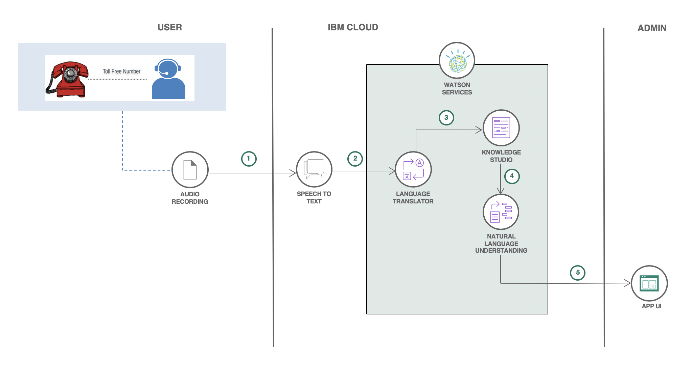

<!--Optionally, add flow steps based on the architecture diagram-->
## Flow

1. Feed the audio to Speech to Text service.
2. Convert the text into english using Watson Language Translator.
3. Feed the English text to Watson Knowledge Studio model which is deployed on Watson Natural Language Understanding.
4. The model deployed on Watson Natural Language Understanding will identify all the required attributes from the text.
5. Visualize the order and customer details from the recordings on a dashboard.

<!--Optionally, update this section when the video is created-->
# Watch the Video

[](https://www.youtube.com/watch?v=n5rrJ0FMGQk)

## Pre-requisites

* [IBM Cloud account](https://www.ibm.com/cloud/): Create an IBM Cloud account.

# Steps

Please follow the below to setup and run this code pattern.

1. [Clone the repo](#1-clone-the-repo)
2. [Setup Watson Speech to Text ](#2-setup-watson-speech-to-text)
3. [Setup Watson Language Translator](#3-setup-watson-language-translator)
4. [Setup Watson Knowledge Studio and Natural Language Understanding](#4-setup-watson-knowledge-studio-and-natural-language-understanding)
5. [Setup IBM Db2](#5-setup-ibm-db2)
6. [Add the Credentials to the Application](#6-add-the-credentials-to-the-application)
7. [Deploy the Application to Cloud Foundry](#7-deploy-the-application-to-cloud-foundry)
8. [Analyze the results](#8-analyze-the-results)

### 1. Clone the repo

Clone the `order_processing_during_pandemics` repo locally. In a terminal, run:

```
$ git clone https://github.com/IBM/offline_order_processing_during_pandemics
```
### 2. Setup Watson Speech to Text

- Create [Watson Speech to Text service](https://cloud.ibm.com/catalog/services/speech-to-text)

- In Speech To Text Service Resource Page, Click on **Services Credentials** and create a **New Credential** as shown.


- Once the credential is created, copy and save the credentials in a text file for using it in later steps in this code pattern.

### 3. Setup Watson Language Translator

Create [Watson Language Translator](https://cloud.ibm.com/catalog/services/language-translator)

Make a note of the Watson Language Translator API Key and URL credentials as shown below,

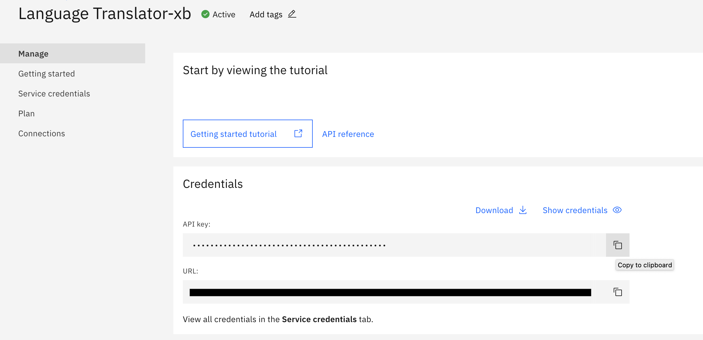

> Note: This service can be used incase you are using regional languages. Watson Language Translator supports these [languages](https://cloud.ibm.com/docs/language-translator?topic=language-translator-translation-models)

### 4. Setup Watson knowledge Studio and Natural Language Understanding

Create the following services:

* [**Natural Language Understanding**](https://cloud.ibm.com/catalog/services/natural-language-understanding)
* [**Watson Knowledge Studio**](https://cloud.ibm.com/catalog/services/knowledge-studio)

#### i. Launch Watson Knowledge Studio and create workspace

* Launch the **Watson Knowledge Studio** tool.
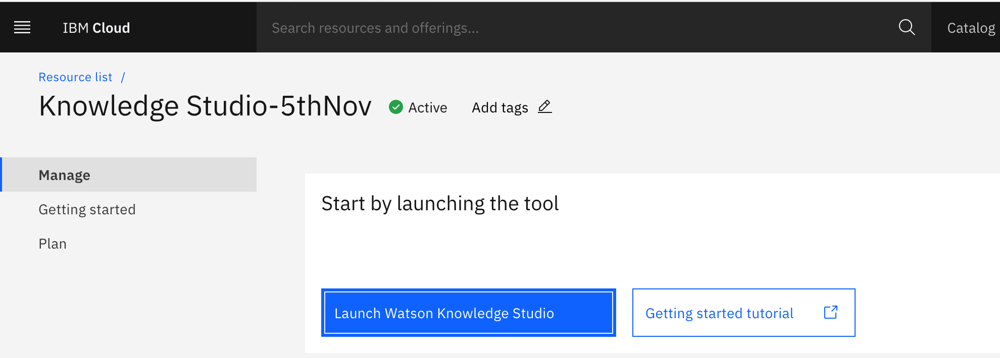

* click on **Create workspace**.

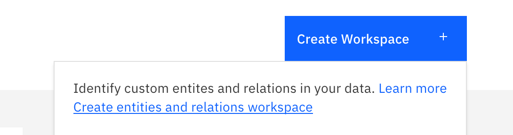

* Enter a unique name and press **Create**.


#### ii. Upload Type System

A type system allows us to define things that 
are specific to review documents, such as product and brand names. The type system controls how content can be annotated by defining the types of entities that can be labeled and how relationships among different entities can be labeled.

To upload our pre-defined type system, from the **Assets** -> **Entity Types** panel, press the **Upload** button to import the Type System file [TypeSystems.json](TypeSystems.json) found in the repository.

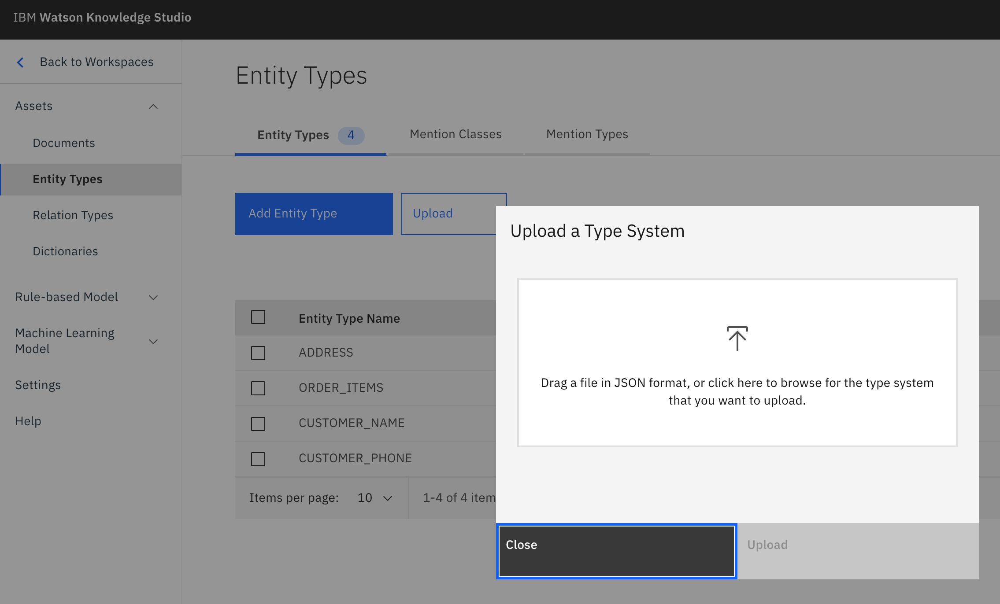

Press the **Upload** button. This will upload a set of Entity Types and Relation Types:

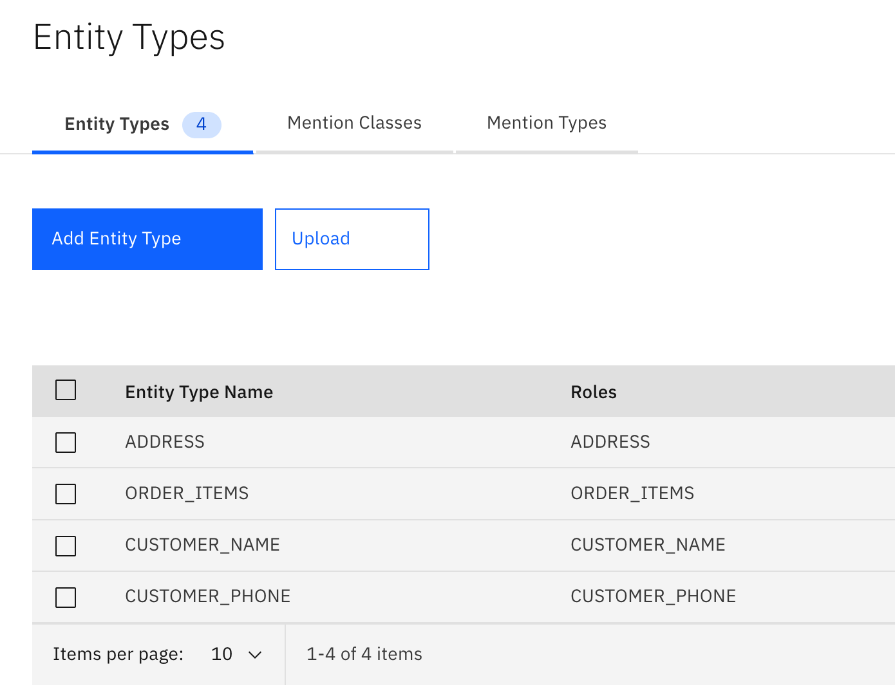

#### iii. Import Corpus Documents

Corpus documents are required to train our machine-learning annotator component. For this code pattern, the corpus documents will contain sample order processing converstation documents.

* From the **Assets** -> **Documents** panel, press the **Upload Document Sets** button to import a Document Set file. 

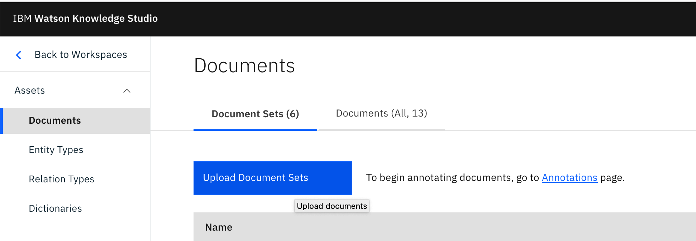


* Use the corpus documents file [training_Files.zip](corpus-Pre-annotated-training-files.zip) found in the local repository.

Once uploaded, you should see a set of documents:

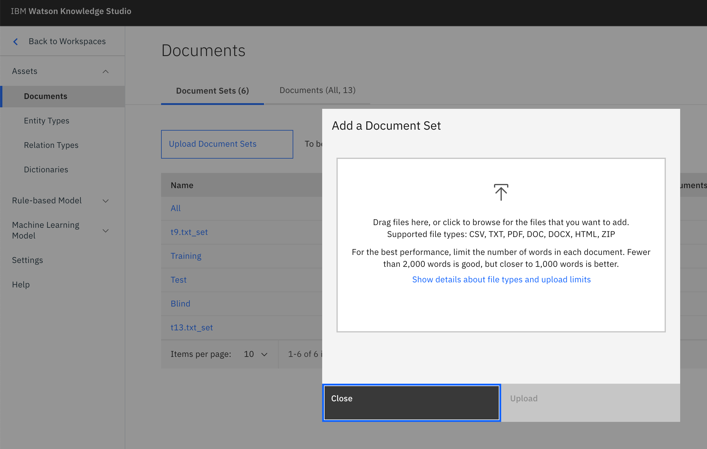


#### iv. Create Custom Model

Since the corpus documents that were uploaded were already pre-annotated and included ground truth, it is possible to build the machine learning annotator directly without the need for performing human annotations.

* Go to the **Machine Learning Model** -> **Performance** panel, and press the **Train and Evaluate** button.

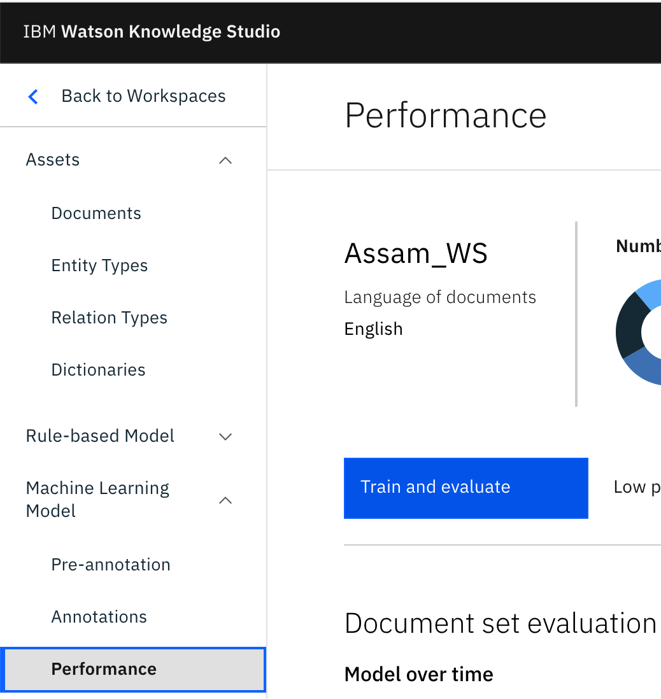

* Click on Edit Settings to ensure you are selecting the corpus document set which we have uploaded in previous step.

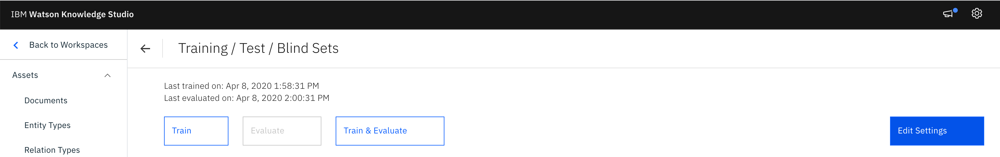

* From the **Document Set** name list, select the annotation sets **Import**. Also, make sure that the option **Run on existing training, test and blind sets** is checked.  Press the **Train & Evaluate** button.

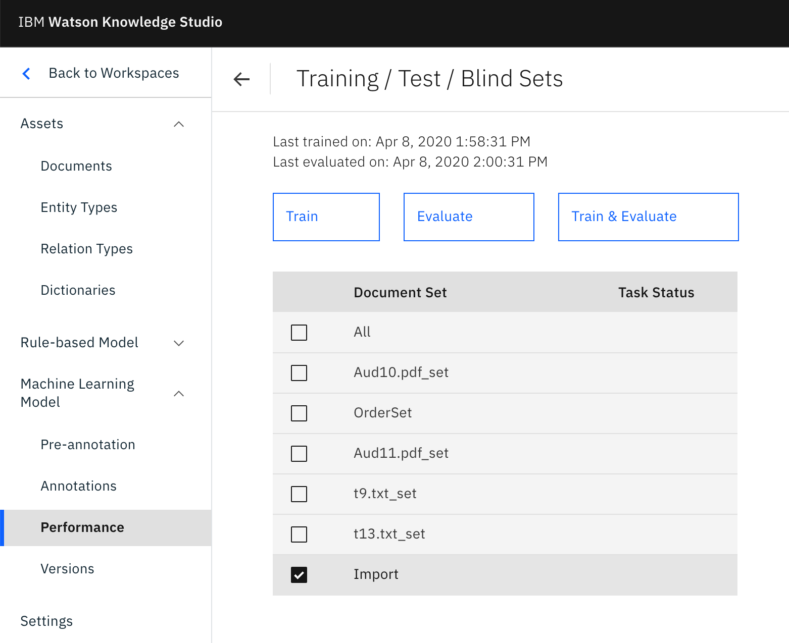

This process may take few minutes to complete. Progress will be shown in the upper right corner of the panel.

You can view the log files of the process by clicking the **View Log** button.

Once complete, you will see the results of the train and evaluate process as successful.


#### v. Deploy the machine learning model to Natural Language Understanding

* Now we can deploy our new model to the already created **Natural Language Understanding** service. Navigate to the **Versions** menu on the left and press **Create Version**.

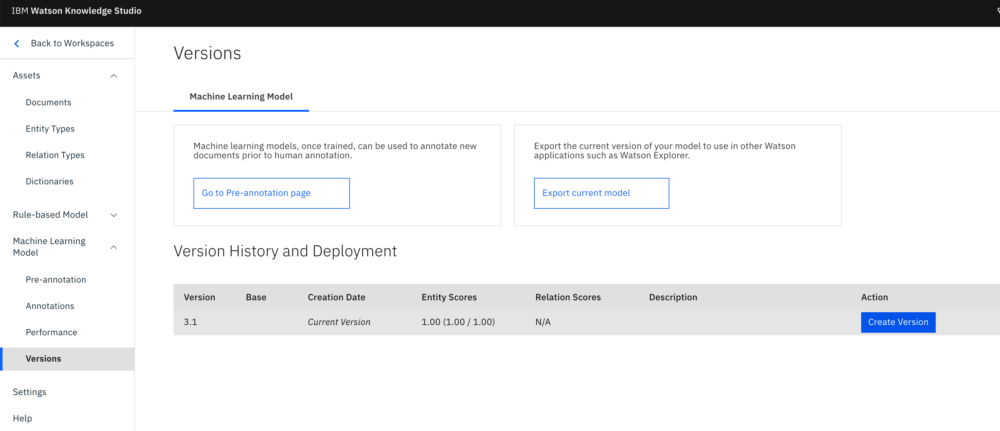

* Give a description on the version that you want to deploy.

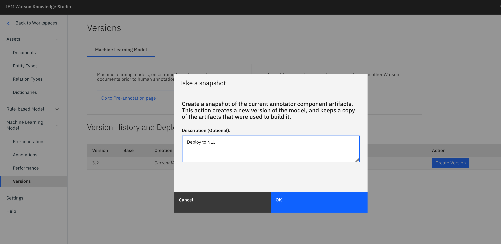

The new version will now be available for deployment to Natural Language Understanding. To start the process, click the **Deploy** button associated with your version.

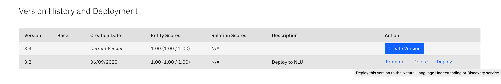

Select the option to deploy to **Natural Language Understanding**.

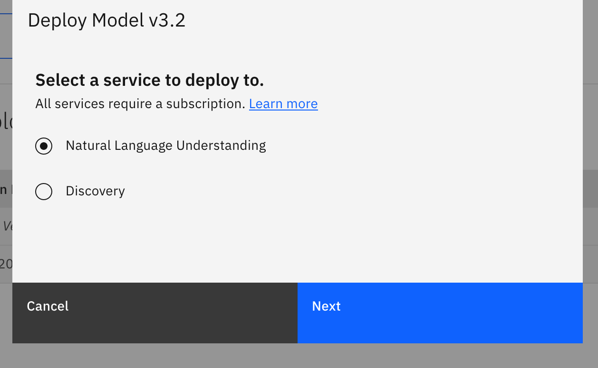

Enter your IBM Cloud account information to locate your **Natural Language Understanding** service to deploy to.

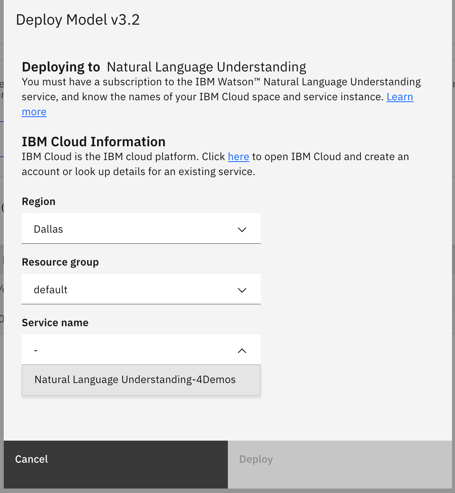

Once deployed, a **Model ID** will be created. Keep note of this value as it will be required later when configuring your credentials.

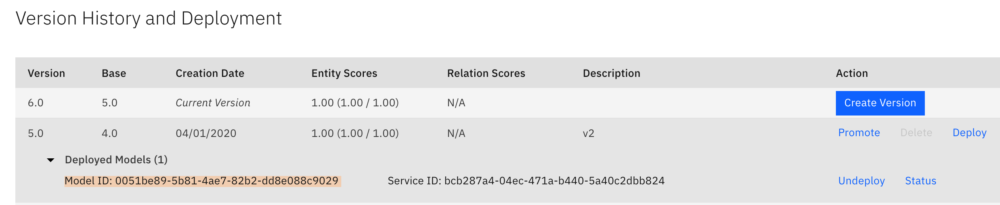

> NOTE: You can also view this **Model ID** by clicking the **Deployed Models** link under the model version.

#### vi. Get the credentials of NLU service.

* Go to IBM Cloud dashboard resource list to note down the NLU credentilas. Click on https://cloud.ibm.com/resources

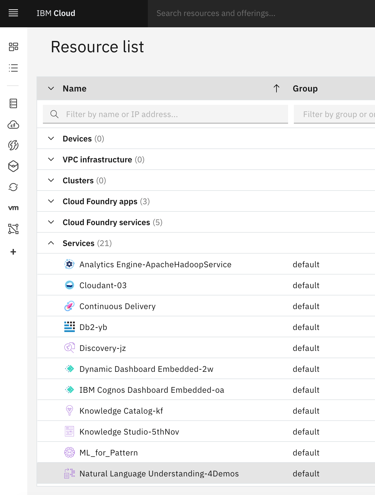

* On the left navigation bar, click on Manage and copy API key and the url to a notepad which will be used in the next section  for UI integration.

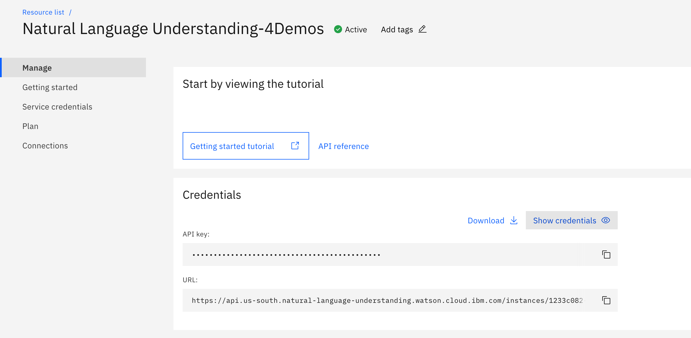

### 5. Setup IBM Db2

- Create a [Db2 service](https://cloud.ibm.com/catalog/services/db2).


- Click on **Service credentials** and click on **New Credentials** to generate credentials and click on save credentials as shown.


### 6. Add the Credentials to the Application

- Open the `credentials.json` file from the root directory and paste the Watson Speech to Text created in [step 2](#2-setup-watson-speech-to-text) and save the file.

- Open the `credentials1.json` file from the root directory and paste the Db2 Credentials created in [step 5](#5-setup-ibm-db2) and save the file.

- Open `app.py` from the root directory, goto line number `33` and insert the natural language understanding API Key `apikey`, goto line number `34` and insert the natural language understanding URL `nlu_url` and lastly goto line number `35` and insert the knowledge studio model ID `wks_model_id`. 

<pre><code># Initialize WKS Model Credentials

apikey = <b>'YOUR-NLU-API-KEY-HERE'</b>
nlu_url = <b>'YOUR-URL-HERE'</b>
wks_model_id = <b>'YOUR-WKS-MODEL-ID-HERE'</b>

</code></pre>

### 7. Deploy the Application to Cloud Foundry

* Make sure you have installed [IBM Cloud CLI](https://cloud.ibm.com/docs/cli?topic=cloud-cli-getting-started&locale=en-US) before you proceed.

* Log in to your IBM Cloud account, and select an API endpoint.
```bash
$ ibmcloud login
```

>NOTE: If you have a federated user ID, instead use the following command to log in with your single sign-on ID.
```bash
$ ibmcloud login --sso
```

* Target a Cloud Foundry org and space:
```bash
$ ibmcloud target --cf
```

* From within the _cloned directory_ push your app to IBM Cloud.
```bash
$ ibmcloud cf push
```

* Once Deployed You will see output on your terminal as shown, verify the state is _`running`_:

<pre><code>Invoking 'cf push'...

Pushing from manifest to org manoj.jahgirdar@in.ibm.com / space dev as manoj.jahgirdar@in.ibm.com...

...

Waiting for app to start...

name:              order-processing-pandemic
requested state:   started
routes:            <b>order-processing-pandemic.xx-xx.mybluemix.net </b>
last uploaded:     Sat 16 May 18:05:16 IST 2020
stack:             cflinuxfs3
buildpacks:        python

type:            web
instances:       1/1
memory usage:    256M
start command:   python app.py
     state     since                  cpu     memory           disk           details
#0   <b>running</b>   2020-05-16T12:36:15Z   25.6%   116.5M of 256M   796.2M of 1
</code></pre>

* Once the app is deployed you can visit the `routes` to view the application.

### 8. Analyze the results

- Once you visit the url `order-processing-pandemic.xx-xx.mybluemix.net` you will see the following screen.

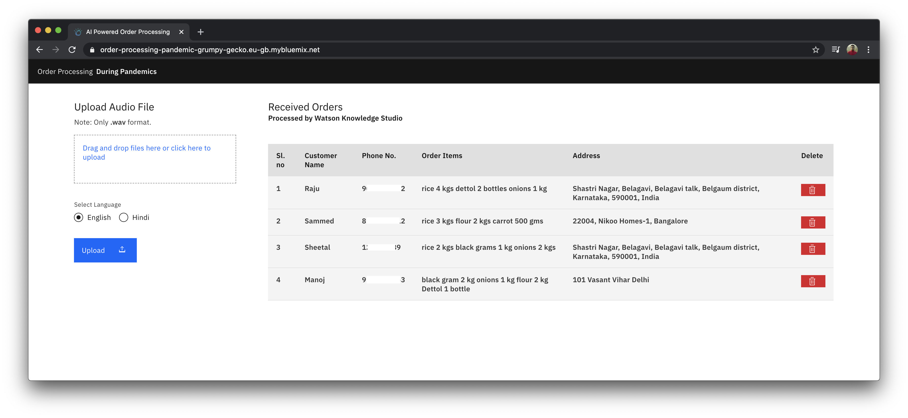

- Upload the **English** telephone conversation to get the orders placed by the person as shown.


- You can play the audio to verify that Watson Knowledge Studio is identifying the entities correctly.

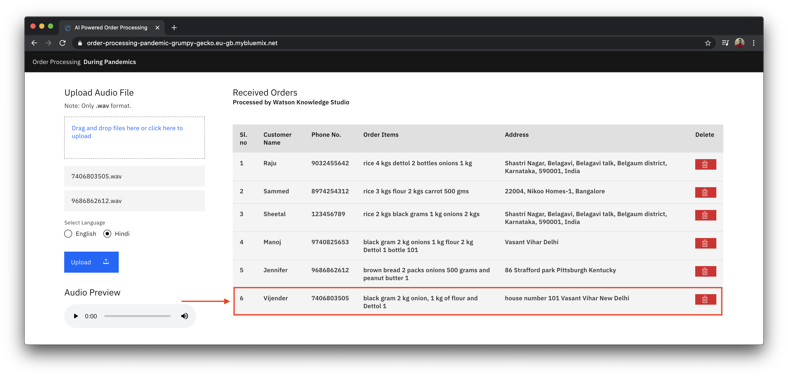

- Similarly upload the **Hindi** regional telephone conversation to get the orders placed by the person as shown.


- You can play the audio to verify that Watson Knowledge Studio is identifying the entities correctly.

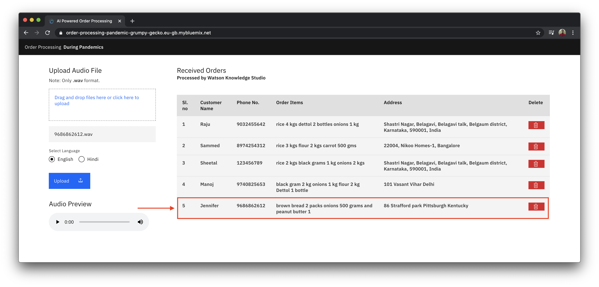